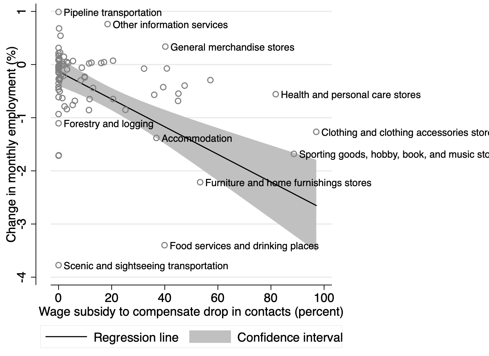

# Which industries contracted the most in March?
The BLS published new statistics on the employment situation of U.S. non-farm businesses. Total employment [fell by 701,000 in March](https://www.bls.gov/news.release/empsit.nr0.htm). The biggest losses were in leisure and hospitality, health care and social assistance, professional services, retail, and construction. 

All of these sectors are highly exposed to social distancing measures introduced to limit the spread of COVID-19. Research by [Koren and Pető (2020)](http://koren.mk/papers/working_papers/social_distancing/) shows that 50 percent of workers in these sectors are vulnerable to social distancing by at least one measure: they engage in face-to-face teamwork, customer contact, or work in close physical proximity to other.

[Koren and Pető (2020)](http://koren.mk/papers/working_papers/social_distancing/) also compute a percentage wage subsidy necessary to compensate businesses for the disruption in human interaction. This depends on the share of communication-intensive workers and the population density in the neighborhood of the business.

The Figure shows the employment change between March and February 2020 (seasonally adjusted, in percent) in each industry, plotted against the predicted exposure to social distancing, as summarized by the necessary wage subsidy (percent).

**Industries more exposed to social distancing suffered larger employment losses**. "Wage subsidy" is computed in a calibrated model of communication and production to compensate businesses for the reduction in human interaction ([Koren and Pető (2020)](http://koren.mk/papers/working_papers/social_distancing/)). The regression line represents the fitted value from an ordinary least squares, weighted by sectoral employment.

Retail sectors have contracted as predicted by the analysis. "Food services and drinking places" and "Scenic transportation" contracted even more. "Information services," "Forestry and logging," and "Pipeline transportation" are not predicted to be exposed to social distancing and did not contract as much as the average.

